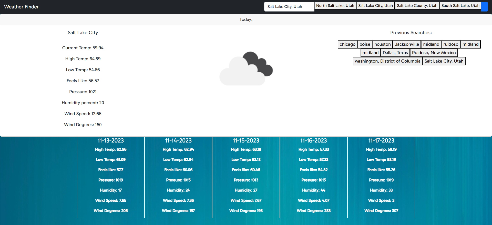

# weatherFinder

Weather Finder

Description

The motivation for this project is to allow users to search for weather by city name.

I built this project to solve a need for people who want to check accurate current weather and 5 day weather by city name.

This project shows off my skills working with JavaScript, JSON, Fetch.

I learned a lot about using fetch and api's. Also other components like event listeners and using innerHTML.

##Installation N/A

##Usage

This webpage contains a search bar. The user will input a city name into the search bar and hit search. The page will auto populate with the current weather in the city and the table shows the 5 day weather forcast. 

##Credits

-Jaytee Padilla, my tutor from the BootCamp Tutoring Team

-Jack Goers , the TA for my UT bootcamp course

##License

Please refer to the License in the repo.

Webpage: https://dcastillomar.github.io/weatherFinder/

